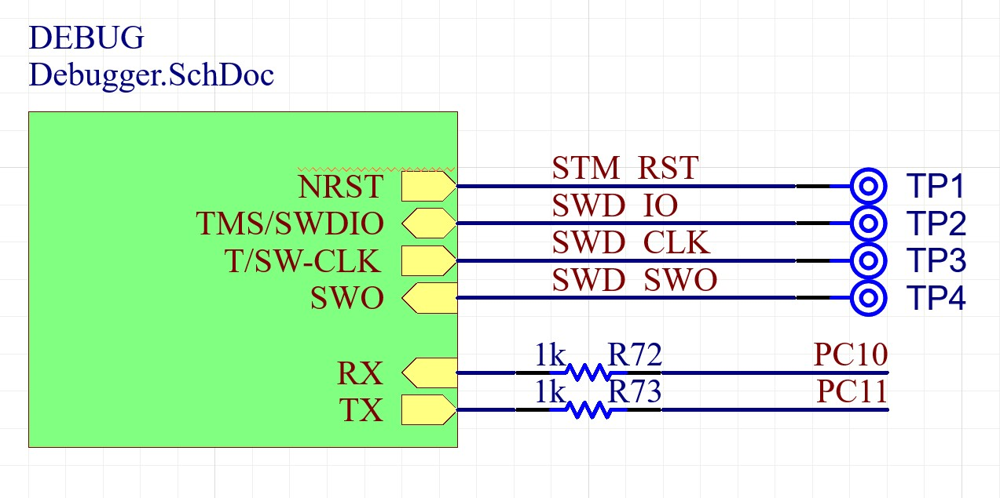

.. _on_board_debugger:

On-Board Debugger (OBD)
########################

.. contents::
   :local:
   :depth: 2

.. note::

    The on-board debugger is available on ARDEP board revision 2.0 and later.

Overview
========

The On board debugger is connected to the ARDEP’s main µC as illustrated below.
The Debug RX/TX Line are connected via 1kOhm resistors to the existing UART-A interface of the PCB with the resistors ensuring that an external device connected to the same UART Interface always has Priority and TX state interference will not cause a short circuit.

   

The Debugger circuit is supplied via the same 3.3V net as the ARDEP’s main µC.
As the debugger µC consumes ~30mA of idle current, which doubles the ARDEP board’s standby power consumption, it was decided to use a power rail supervisor to keep the debugger in reset state when no USB host is connected to the debug USB port.
Measurement results have shown that this implementation can reduce the debugger’s idle current from ~30mA to ~4mA.

Host Interface
===============

The ARDEP mainboard integrates a `Black Magic Probe <https://black-magic.org/index.html>`_, exposing the following features:

- Second USB-C connector labeled ``DEBUG`` for host connectivity

- Two USB CDC ACM interfaces provided to the host system

  - ``uart-a`` bridge for a bidirectional serial console

  - Integrated GDB server for firmware debugging

.. note::

  Under linux, the gdb server usually has the lower numbered device node (e.g. ``/dev/ttyACM0``) while the UART console is assigned to the higher numbered one (e.g. ``/dev/ttyACM1``). Verify this by checking the device logs with ``dmesg`` after connecting the debugger.

